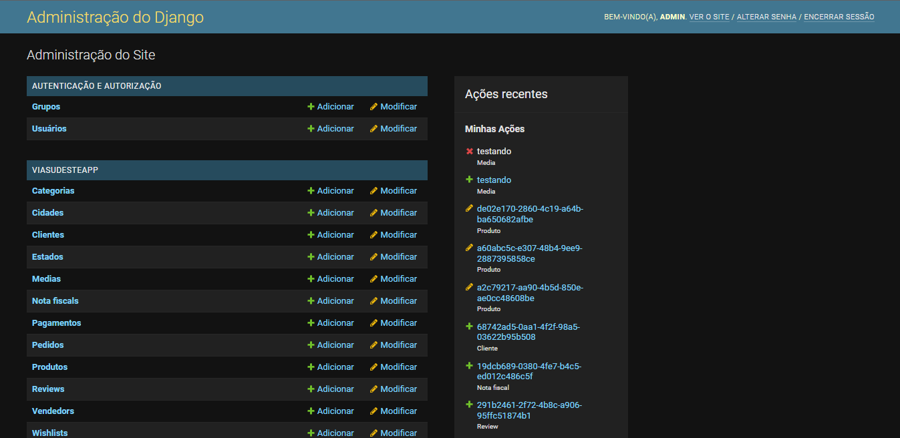
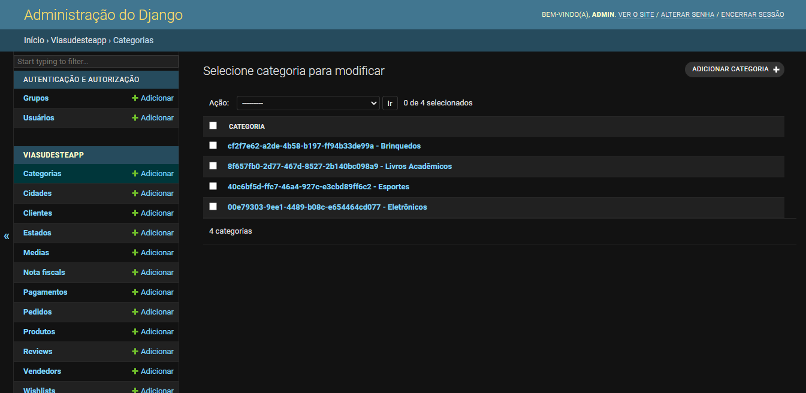
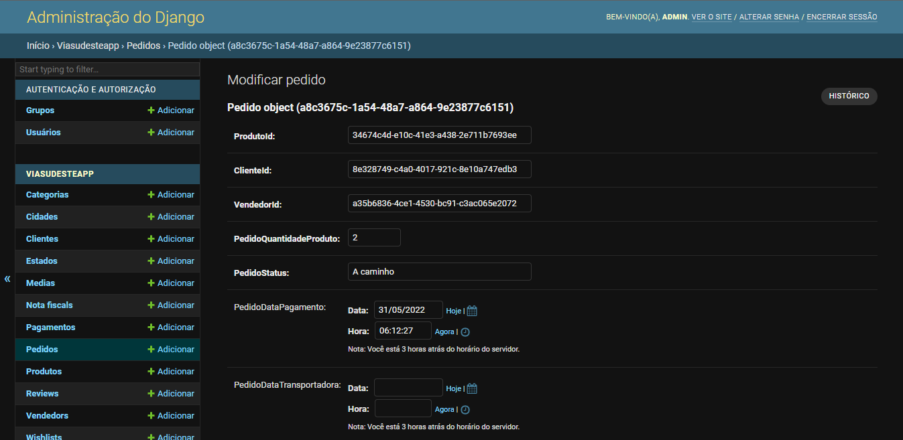
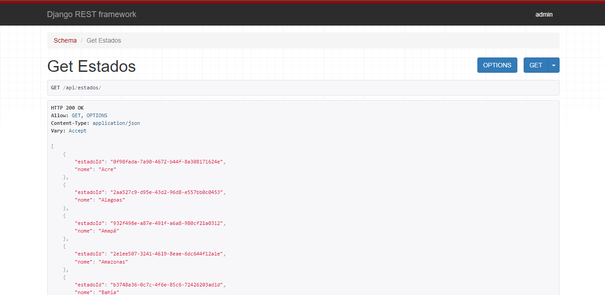
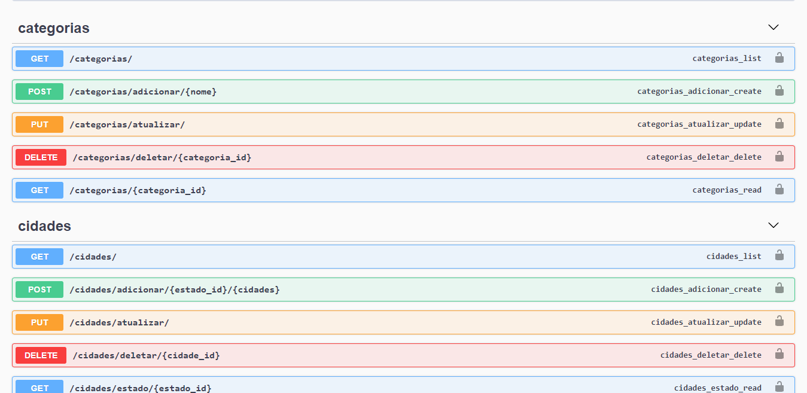

# Como usar

Nesta página iremos te mostrar como usar o serviço para consultas e testes. Lembrando sempre que as mudanças são apenas locais.

## **Django Admin**

O Djago Admin é uma página pré-configurada pelo Django que facilita o uso do framework. Nela, temos acesso a tudo que nossa aplicação possui, criação, leitura, edição e remoção de dados no banco de dados. É uma forma bem simples de mexer no banco para fins de testes. 

Seu uso é bem simples, a interface é bem amigável e fácil de entender. Na página inicial, temos todas as tabelas presentes no nosso banco de dados, você pode acessar qualquer uma delas e fazer as modificações desejadas. Além disso, na parte direita da tela existe um histórico de ações que ajuda muito o usuário para relembrar antigas modificações.

Para acessar, com o projeto rodando no terminal [clique aqui](localhost:8000/admin).

**Login**: admin
<br>
**Senha**: admin





## **Django REST Framework**

O Django REST Framework é outra opção pré-configurada pelo Django que facilita a visualização dos endpoints da nossa API REST. Ao entrar nos endpoints, o Django mostra uma página estilizada com as informações daquele endpoint, como por exemplo seu método HTTP e sua resposta (Response). Com isso, já é possível observar como a nossa API está tratando e fornecendo os dados aos usuários que vão consumí-la no futuro.

A utilização também é bem simples e intuitiva, basta acessar os endpoints e começar a explorar as opções disponibilizadas pelo Django.

Para acessar, com o projeto rodando no terminal abra uma aba no navegador e digitar:
```
localhost:8000/<endpoint>

exemplo: localhost:8000/estados
```



## **Swagger API**

O Swagger é outro framework para documentação e desenvolvimento de API's. Nele, é possível configurar uma página Web com todos os endpoints presentes na API REST, facilitando muito o trabalho do usuário e até mesmo do desenvolvedor. Ele é o mais simples de usar até então, basta selecionar o grupo que você deseja explorar os endpoints e começar a brincar. Nele, conseguimos consumir de fato nossa API como um produto final e como outras pessoas consumiriam no futuro.

Para acessar, com o projeto rodando no terminal [clique aqui](www.localhost:8000/api).

