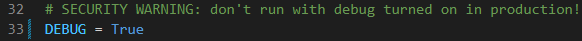
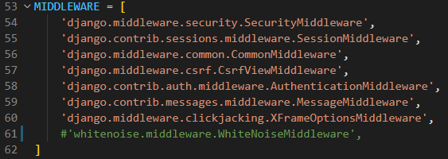
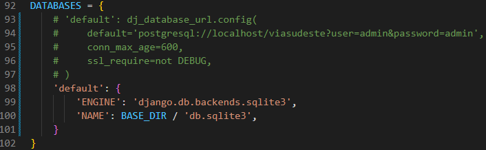
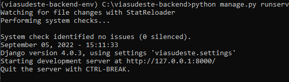

# Clonando e preparando o ambiente

Nesta página iremos te mostrar um passo a passo de como clonar e preparar o ambiente para começar a mexer no projeto.

## **Clonando**

Para começar, clone o [repositório do github](https://github.com/guishas/via-sudeste-backend) em uma pasta de sua escolha. Se tiver dúvida de como fazer isso, siga o tutorial abaixo, caso contrário pule para o segundo passo.

Antes de mais nada, [instale o Python](https://python.org.br/instalacao-windows/) se você ainda não tiver ele instalado na sua máquina.

#### Tutorial

1 - Abra o terminal apertando ```Windows + R``` e digitando ```cmd```.
<br>
<br>
2 - Navegue até a pasta de escolha para clonar o repositório utilizando o comando ```cd <nome da pasta>```.
<br>
<br>
3 - Clone o repositório com o comando:
```
git clone git@github.com:guishas/via-sudeste-backend.git
```

4 - Entre na pasta do repositório (ela se chama **via-sudeste-backend**).
<br>
<br>
5 - Instale as bibliotecas necessárias com o comando:
```
pip install -r requirements.txt
```

## **Preparando o ambiente**

Agora vamos configurar algumas coisas e preparar o ambiente para começar a explorar e mexer no projeto.

Abra o arquivo "settings.py" na pasta "viasudeste/" e confira se as variáveis das imagens abaixo estão como na imagem. Se não estiverem, corrija.





Por fim, podemos rodar o projeto e começar a explorá-lo. Vá para a raiz do repositório e rode o comando no terminal:
```
python manage.py runserver
```

Você deve receber uma mensagem assim no seu terminal:

